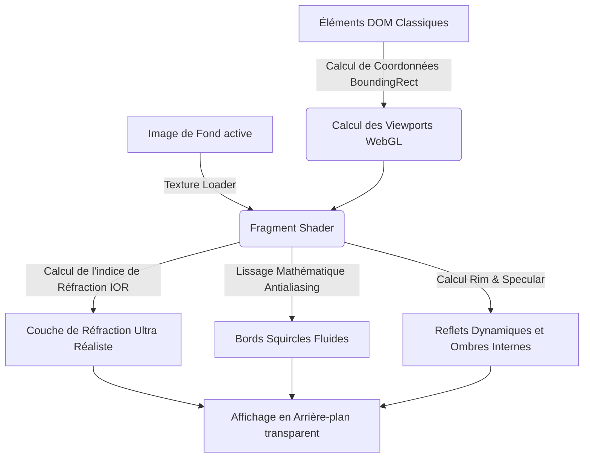
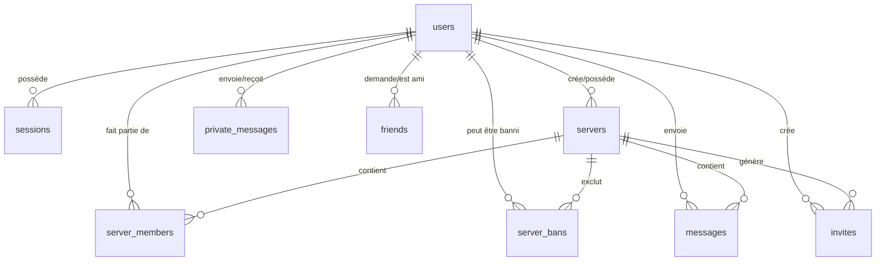

# ☁️ NUBE — Forum SPA & Messagerie Temps Réel

[](https://golang.org/)
[](https://threejs.org/)
[](https://www.sqlite.org/)
[](https://www.docker.com/)

**NUBE** (Nuage) est une application web moderne de type Single Page Application (SPA), alliant la robustesse et la rapidité d'un backend en **Golang** à une interface utilisateur fluide en **Vanilla JS**, sublimée par un moteur de rendu **WebGL (Three.js)** de dernière génération. 

Inspirée par Discord et Slack, NUBE propose un système complet de serveurs de discussion publique, de messagerie privée point-à-point en temps réel, de gestion d'amis, de profils hautement personnalisables, d'invitations dynamiques et d'outils de modération poussés.

---

## 🎨 Le Moteur Visuel : *LiquidGlass Engine*

Au-delà d'une simple SPA, NUBE intègre un moteur graphique développé sur-mesure utilisant **WebGL** et **Three.js** via un shader de réfraction avancé : le **LiquidGlass Engine** (`liquidGlass.js`).



### Caractéristiques du Shader :
* **Réfraction Mathématique Réaliste :** Calcule en temps réel l'indice de réfraction (`uIOR`), la courbure du biseau (`uBezel`) et l'épaisseur du verre (`uThickness`) par rapport à l'image d'arrière-plan choisie.
* **Transitions Organiques (LERP) :** Au survol ou au clic sur un conteneur interactif (bouton, salon, salon privé), le shader intercepte les événements DOM pour appliquer des transitions fluides à vitesse d'amortissement linéaire (`lerpSpeed = 0.15`).
* **Antialiasing Mathématique :** Utilise des fonctions mathématiques de distance signée (`sdRoundedRect` et `smoothstep`) pour garantir des contours parfaitement lisses, sans crénelage, quelle que soit la résolution de l'écran.

---

## 📂 Architecture Globale & Structure du Projet

Le projet adopte une séparation stricte entre le serveur d'API (Backend) et l'interface modulaire (Frontend).

```
.
├── backend/
│   ├── database/
│   │   ├── cleaner.go          # Routine cyclique d'auto-nettoyage (mutes, sessions, invites)
│   │   └── sqlite.go           # Initialisation, schéma strict & injections par défaut
│   ├── handlers/
│   │   ├── auth.go             # Inscription, Connexion & Déconnexion
│   │   ├── auth_test.go        # Tests unitaires Bcrypt et force des mots de passe
│   │   ├── hub.go              # Gestionnaire central des connexions WebSocket (Hub)
│   │   ├── invites.go          # Génération de codes & logique d'intégration
│   │   ├── messages.go         # Historiques de messages (publics & DMs)
│   │   ├── middleware.go       # Sécurité (CSP, Headers) & Rate limiters (strict & global)
│   │   ├── moderation.go       # Commandes Admin (Mute temporaire/infini, Bannissement)
│   │   ├── servers.go          # Gestion des serveurs, rôles et configurations
│   │   ├── settings.go         # Profils utilisateurs & uploads d'arrière-plans
│   │   ├── users.go            # Gestion des amis, recherches & avatars
│   │   └── websocket.go        # Lecture, écriture & sécurité (antispam, protection XSS)
│   ├── utils/
│   │   ├── helpers.go          # Fonctions d'aide (session helper, MIME type validator)
│   │   ├── helpers_test.go     # Tests unitaires de validation de signatures d'images
│   │   └── structs.go          # Structures de données partagées (JSON mappings)
│   └── main.go                 # Point d'entrée, serveurs d'API, WebSocket & fermeture propre
├── frontend/
│   ├── assets/                 # Icônes, arrière-plans préinstallés & ressources statiques
│   ├── components/             # Composants HTML chargés en lazy-loading
│   ├── css/
│   │   └── style.css           # Feuille de style principale (Variables, Grids, Animations)
│   ├── js/                     # Modules Javascript ES6
│   └── index.html              # Fichier HTML d'entrée de la SPA
├── uploads/                    # Stockage persistant des images téléversées (avatars, bg)
├── Dockerfile                  # Construction multi-étape optimisée
├── go.mod                      # Dépendances Go
└── forum.db                    # Base de données SQLite3
```

---

## 🗃️ Modèle de Données (Schéma SQLite3)

La base de données repose sur un schéma relationnel strict avec clés étrangères actives (`PRAGMA foreign_keys = ON;`) et suppression en cascade (`ON DELETE CASCADE`) pour éviter tout résidu orphelin.



### Tables du Système :

#### `users`
Stocke l'identité complète des utilisateurs avec hachage sécurisé.
* `id` (TEXT - PRIMARY KEY) : UUID Google.
* `nickname` (TEXT - UNIQUE) : Pseudo d'affichage.
* `email` (TEXT - UNIQUE) : Email d'authentification.
* `password` (TEXT) : Hash Bcrypt.
* `age` (INTEGER), `gender` (TEXT), `first_name` (TEXT), `last_name` (TEXT) : Profil additionnel.
* `avatar` (TEXT) : Chemin vers l'image de profil (par défaut vide).
* `bio` (TEXT) : Courte description (par défaut vide).
* `background` (TEXT) : Chemin de l'image de fond active du client.
* `last_server_id` (TEXT) : ID du dernier serveur visité pour reconnexion automatique.
* `created_at` (DATETIME) : Horodatage d'inscription.

#### `sessions`
Gère l'authentification sécurisée sans état (Stateless).
* `id` (TEXT - PRIMARY KEY) : UUID de session (transmis par cookie HttpOnly).
* `user_id` (TEXT - FOREIGN KEY) : Liaison vers l'utilisateur.
* `expires_at` (DATETIME) : Date limite de validité de la session.

#### `servers`
Définit les espaces de discussion (Channels).
* `id` (TEXT - PRIMARY KEY) : Identifiant unique.
* `name` (TEXT) : Nom d'affichage.
* `owner_id` (TEXT - FOREIGN KEY) : UUID du créateur / propriétaire.
* `color` (TEXT) : Couleur persistante choisie à la création.
* `avatar` (TEXT) : Image personnalisée du serveur.
* `created_at` (DATETIME) : Date de création.

#### `server_members`
Gère l'appartenance à un serveur et les privilèges associés.
* `server_id` (TEXT), `user_id` (TEXT) : PRIMARY KEY Composite.
* `last_read_at` (DATETIME) : Dernier instant de lecture pour le calcul des messages non lus.
* `role` (TEXT - Default 'member') : Rôle dans le serveur (`admin` ou `member`).
* `muted_until` (DATETIME) : Limite de temps du mute utilisateur.

#### `server_bans`
Liste noire d'exclusion des serveurs.
* `server_id` (TEXT), `user_id` (TEXT) : PRIMARY KEY Composite.
* `reason` (TEXT) : Raison du bannissement.
* `created_at` (DATETIME) : Date du ban.

#### `messages`
Messages publics échangés dans les serveurs.
* `id` (TEXT - PRIMARY KEY) : UUID unique.
* `server_id` (TEXT - FOREIGN KEY) : Serveur de destination.
* `sender_id` (TEXT - FOREIGN KEY) : Auteur du message.
* `content` (TEXT) : Contenu textuel.
* `message_type` (TEXT - Default 'user') : Type de message (`user` ou `system` pour les messages système).
* `created_at` (DATETIME) : Date de publication.

#### `private_messages`
Messages privés bilatéraux (DMs) cryptographiquement isolés des salons publics.
* `id` (TEXT - PRIMARY KEY) : UUID unique.
* `sender_id` (TEXT - FOREIGN KEY) : Envoyeur.
* `receiver_id` (TEXT - FOREIGN KEY) : Destinataire.
* `content` (TEXT) : Contenu.
* `created_at` (DATETIME) : Date d'envoi.

#### `private_read_receipts`
Accusés de lecture pour la messagerie privée.
* `user_id` (TEXT), `peer_id` (TEXT) : PRIMARY KEY Composite.
* `last_read_at` (DATETIME) : Date de dernière lecture des DMs reçus de cet ami.

#### `invites`
Liaisons d'invitations dynamiques à durée limitée.
* `token` (TEXT - PRIMARY KEY) : Jeton court de 8 caractères unique.
* `server_id` (TEXT - FOREIGN KEY) : Serveur cible.
* `creator_id` (TEXT - FOREIGN KEY) : Auteur de l'invitation.
* `created_at` / `expires_at` (DATETIME) : Validité (24h par défaut).

#### `friends`
Table de relation sociale.
* `user_id1` (TEXT), `user_id2` (TEXT) : PRIMARY KEY Composite triée par ordre alphanumérique pour éviter les doublons.
* `status` (TEXT - Default 'pending') : État (`pending` ou `accepted`).
* `action_user_id` (TEXT) : ID du dernier utilisateur ayant interagi (pour déterminer l'envoyeur).
* `created_at` (DATETIME) : Date d'initiation.

---

## 🛠️ Fonctionnalités Avancées du Système

### 🛡️ Sécurité de Niveau Production
* **Bcrypt :** Hachage robuste des mots de passe.
* **Password Strength Checker :** Inscription impossible sans mot de passe complexe (min. 8 caractères, 1 majuscule, 1 chiffre, 1 caractère spécial).
* **Cookies HttpOnly & Secure :** Session stockée de manière invisible pour le Javascript client, limitant drastiquement les failles XSS.
* **Double Rate-Limiting :**
  1. *Strict Rate-Limit :* 5 tentatives de connexion/inscription par minute maximum par IP.
  2. *Global API Rate-Limit :* 120 requêtes API par minute maximum par IP (protection anti-DDoS).
* **Content Security Policy (CSP) & Headers de sécurité :** Paramétrage rigoureux bloquant les injections de scripts tiers (`unsafe-eval` banni, connectivité WebSocket sécurisée, interdiction de rendu en Iframe avec `X-Frame-Options: DENY`).
* **HTML Sanitization :** Nettoyage automatique du contenu des messages en entrée du WebSocket via la politique stricte de **Bluemonday** (`bluemonday.StrictPolicy()`) supprimant toutes les balises HTML/JS malicieuses.

### 📡 Messagerie WebSocket Avancée
* **ReadPump & WritePump :** Architecture asynchrone isolant la réception et l'envoi de trames pour chaque client connecté dans des routines concurrentes légères.
* **Auto-Reconnection Loop :** Reconnexion silencieuse et instantanée côté client en cas de micro-coupure réseau.
* **Spam Protection WebSocket :** Restriction stricte (maximum 1 message toutes les 100ms ET pas plus de 10 messages en 10 secondes). En cas de dépassement, le client reçoit une alerte système immédiate et l'interface utilisateur bloque temporairement la saisie.
* **Message Grouping (Discord-Like) :** Si un utilisateur envoie plusieurs messages consécutifs dans un intervalle de 10 minutes, les messages s'empilent proprement sous un seul en-tête d'avatar et de pseudo au lieu de dupliquer les informations.
* **Horodatage Intelligent (Smart Timestamps) :** Les dates se formatent dynamiquement ("10:24", "Hier à 10:24", "15 avril à 10:24") par rapport à l'heure du client.

### 🤝 Réseau Social Intégré
* **Recherche Globale :** Barre de recherche en temps réel permettant de trouver des utilisateurs par leur pseudo unique pour initier une conversation ou une demande d'ami.
* **Gestion Sociale Complète :** Système de demandes d'amis en attente, acceptation, refus et suppression.
* **Indicateurs de Présence :** Synchronisation WebSocket instantanée du statut (En ligne/Hors ligne) sur les avatars de la liste de contacts.

### ⚙️ Profils & Customisation Graphique Premium
* **Canvas Cropper (HTML5) :** Outil intégré de recadrage d'image circulaire à l'upload d'un avatar. L'image est repositionnée, zoomée, puis compressée côté client au format optimisé **WebP (128x128px, 80% qualité)** pour des requêtes réseau légères.
* **Dynamic Profile Banner :** Algorithme lisant l'avatar d'un utilisateur au chargement de son profil, analysant la moyenne calorimétrique des couleurs du haut et du bas de l'image via un canvas invisible, et générant un **dégradé CSS dynamique** unique assorti à l'avatar !
* **Arrière-plans Personnalisés :** Choix d'un arrière-plan parmi une sélection native ou possibilité de téléverser sa propre image. Le fichier est redimensionné en `1920x1080px`, converti en **WebP haute définition compressé**, sauvegardé dans les uploads, et appliqué instantanément sur le shader WebGL.

### 🔨 Système de Modération Intégré (Rôles & Sanctions)
* **Serveurs & Rôles :** Les propriétaires de serveurs peuvent déléguer des privilèges en attribuant les rôles `admin` ou `member` à leurs invités.
* **Silence Temporaire ou Définitif (Mute) :** Les administrateurs peuvent réduire au silence un fauteur de trouble pendant une durée définie (10 min, 1 heure, 24 heures) ou de façon indéfinie. Le mute bloque l'écriture côté client et filtre/rejette les messages directement dans la boucle WebSocket du serveur.
* **Expulsion & Bannissement (Ban) :** Permet d'exclure définitivement un membre. Son ID est inscrit dans la table de blocage du serveur, lui interdisant tout retour même s'il tente d'utiliser un lien d'invitation valide.

### 🧹 Auto-Cleaning Daemon (Routines Backend)
Au démarrage du serveur Golang, un démon d'arrière-plan s'active sur un battement d'horloge horaire (`time.NewTicker(1 * time.Hour)`). Il procède de manière autonome aux tâches suivantes :
1. Suppression en base de données de toutes les invitations expirées.
2. Suppression des sessions utilisateur périmées (déconnexion automatique de sécurité).
3. Levée des mutes arrivés à terme (rétablissement de la parole automatique des membres).

---

## 🔗 Catalogue des Endpoints API REST

### 🔐 Authentification & Session
* `POST /api/register` : Crée un nouveau compte. *(Rate-Limited)*
* `POST /api/login` : Authentifie l'utilisateur et dépose le cookie `session_token`. *(Rate-Limited)*
* `POST /api/logout` : Supprime la session en BDD et invalide le cookie client.
* `GET /api/me` : Renvoie les informations essentielles de l'utilisateur connecté.

### 👥 Profils & Paramètres
* `GET /api/user-profile?user_id=[UUID]` : Renvoie la bio, la date de création de compte et l'état en ligne d'un utilisateur.
* `POST /api/settings` : Met à jour la biographie ou l'arrière-plan de l'utilisateur.
* `POST /api/avatar` : Met à jour l'avatar de l'utilisateur.
* `POST /api/background/upload` : Téléverse une image d'arrière-plan personnalisée (WebP compressé).
* `POST /api/users/delete` : Supprime définitivement le compte de l'utilisateur connecté, nettoie ses fichiers d'avatar/background et supprime ses serveurs créés.

### 💬 Salons & Serveurs
* `POST /api/servers` : Crée un nouveau serveur de discussion (Nom, Couleur).
* `POST /api/servers/delete` : Supprime un serveur de discussion (Propriétaire uniquement).
* `GET /api/my-servers` : Liste tous les serveurs dont l'utilisateur connecté est membre, avec le nombre exact de membres calculé par SQL.
* `GET /api/server-members?server_id=[UUID]` : Renvoie la liste complète des membres d'un serveur avec leur statut actuel et leur rôle.
* `POST /api/servers/update-overview` : Modifie le nom et l'image d'illustration d'un serveur (Admin uniquement).
* `GET /api/servers/role?server_id=[UUID]` : Renvoie le rôle et le statut de mute (avec durée) de l'utilisateur connecté dans ce serveur.
* `POST /api/users/last-server` : Enregistre le serveur actif actuel dans le profil de l'utilisateur.

### 🚫 Modération & Rôles
* `POST /api/servers/update-role` : Permet de basculer un membre entre `member` et `admin`.
* `POST /api/servers/mute` : Réduit au silence un membre (Admin uniquement, durée paramétrable).
* `POST /api/servers/ban` : Bannit définitivement et exclut un membre (Admin uniquement).

### 🤝 Social & Amis
* `GET /api/users/search?q=[query]` : Recherche des utilisateurs (recherche minimale de 2 caractères).
* `POST /api/friends/add` : Envoie une demande d'ami.
* `GET /api/friends/list` : Liste tous les amis acceptés (avec présence, nombre de messages privés non lus et date du dernier message) et demandes d'amis en attente de traitement.
* `POST /api/friends/accept` : Accepte une demande d'ami.
* `POST /api/friends/decline` : Rejette ou supprime une relation d'amitié.

### 📨 Invitations
* `POST /api/invites` : Génère un jeton unique d'invitation de 8 caractères valable 24 heures (Admin uniquement).
* `POST /api/join` : Permet de rejoindre un serveur via son code d'invitation (vérifie les bannissements).

### ✉️ Historique des Messages
* `GET /api/messages?server_id=[UUID]&offset=[int]` : Charge l'historique public d'un salon (par lot de 50 messages, triés chronologiquement).
* `GET /api/messages/private?user_id=[UUID]&offset=[int]` : Charge l'historique des DMs échangés avec un ami.
* `GET /api/notifications/unread` : Récupère la liste des messages non lus par serveur.
* `POST /api/users/mark-private-read` : Marque les messages privés reçus d'un ami comme lus.

### 🔌 Connexions Temps Réel
* `GET /ws` : Point d'accès de mise à niveau de connexion (Upgrade) vers le protocole WebSocket.

---

## 📡 Types d'Événements WebSocket (Payloads JSON)

Le WebSocket transmet des objets JSON contenant systématiquement un champ `type` pour orienter le traitement côté client.

| Type d'événement | Rôle | Variables Clés |
|---|---|---|
| `user_status` | Signale la connexion ou déconnexion d'un utilisateur. | `user_id`, `status` (`online`/`offline`) |
| `public` | Transmission d'un message sur un salon public. | `sender`, `sender_id`, `avatar`, `content`, `server_id`, `message_type` |
| `private` | Transmission d'un message privé point-à-point. | `sender`, `sender_id`, `avatar`, `content`, `receiver_id` |
| `member_join` | Notification de l'arrivée d'un nouveau membre dans un serveur. | `server_id`, `user_id`, `nickname` |
| `friend_request`| Notification de réception d'une demande d'ami. | `sender_id`, `target_id`, `status` |
| `friend_accept` | Notification de l'acceptation d'une demande d'ami. | `sender_id`, `target_id` |
| `friend_remove` | Notification de suppression d'une relation d'amitié. | `sender_id`, `target_id` |
| `mute_update` | Notification de mise sous silence ou de libération de parole. | `server_id`, `is_muted`, `until` |
| `avatar_update` | Propagation en direct d'un changement d'image de profil. | `user_id`, `avatar` |
| `system` | Notification système directe (ex: avertissement antispam). | `content`, `message_type` |

---

## 🚀 Installation & Lancement

### Préréquis
* Avoir [Go](https://go.dev/dl/) installé (version 1.22 ou supérieure conseillée).
* Disposer d'un compilateur C (GCC obligatoire pour la compilation de `go-sqlite3` utilisant CGO).

### 💻 Lancement Local Natif

1. **Cloner le dépôt et se placer à la racine :**
   ```bash
   git clone <url_du_depot>
   cd NUBE
   ```

2. **Installer les dépendances Go :**
   ```bash
   go mod download
   ```

3. **Lancer le serveur :**
   ```bash
   go run backend/main.go
   ```
   *Le serveur démarre. Si la base `forum.db` n'existe pas, elle est créée et configurée instantanément, puis injecte par défaut l'utilisateur "System" et le "Salon Général".*

4. **Accéder à l'application :**
   Ouvrez votre navigateur sur [http://localhost:8080](http://localhost:8080).

---

### 🐳 Lancement via Docker

NUBE propose une configuration **Docker** optimisée basée sur une construction multi-étapes (Multi-Stage Build). L'étape de compilation (`builder`) utilise une image Go avec tous les outils C nécessaires, tandis que l'image finale est basée sur un environnement **Alpine Linux** ultra-léger contenant uniquement l'exécutable compilé statiquement et les fichiers frontend.

1. **Construire l'image Docker :**
   ```bash
   docker build -t nube-forum .
   ```

2. **Lancer le conteneur :**
   ```bash
   docker run -p 8080:8080 nube-forum
   ```

3. **Accéder à l'application :**
   Ouvrez votre navigateur sur [http://localhost:8080](http://localhost:8080).

---

## 🧪 Suite de Tests Unitaires

NUBE dispose de tests unitaires couvrant la sécurité cryptographique et les filtres de sécurité d'uploads.

Pour exécuter tous les tests du projet, lancez simplement la commande suivante à la racine :
```bash
go test ./backend/... -v
```

### Détail des Tests :
* **`TestIsPasswordStrong` :** Valide le comportement du filtre d'inscription sur la complexité requise pour les mots de passe.
* **`TestPasswordHashingAndVerification` :** Vérifie que la génération et la comparaison des empreintes Bcrypt se déroulent de manière étanche (le mot de passe n'est jamais stocké en clair et les mauvais mots de passe sont correctement rejetés).
* **`TestValidateImageMimeType` :** Simule des signatures binaires de fichiers (MIME Sniffing) pour certifier que seuls les formats autorisés (`image/png`, `image/jpeg`, `image/webp`) passent le filtre d'écriture sur le disque, et bloque les fichiers malveillants masqués (comme les scripts HTML ou fichiers texte brut).

---

<p align="center"><i>Développé avec passion pour offrir une expérience de discussion temps réel inégalée sous réfraction liquide. ☁️</i></p>